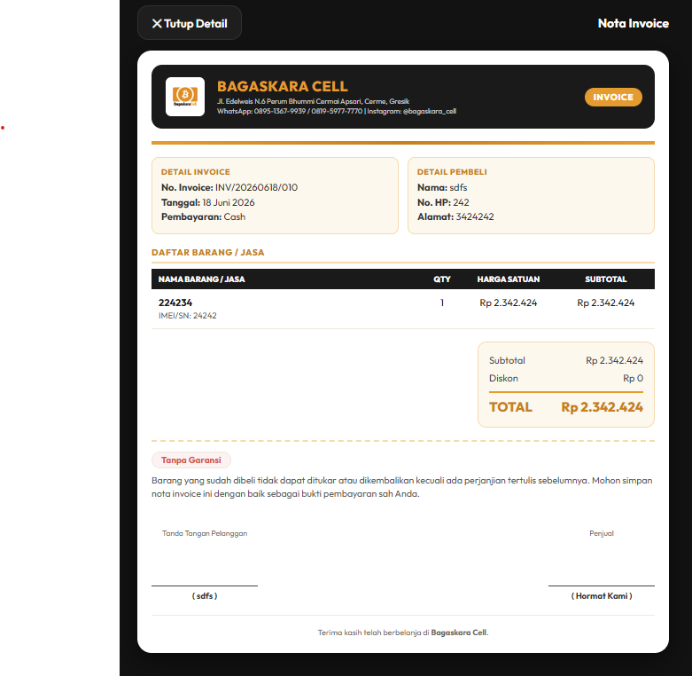

<p align="center">
  
</p>

<h1 align="center">📱 Bagaskara Cell — POS & Invoice</h1>

<p align="center">
  <strong>Aplikasi kasir & invoice mobile offline-first untuk konter handphone</strong>
</p>

<p align="center">
  
  
  
  
</p>

<p align="center">
  
  
  
  
</p>

---

## 📸 Preview

<p align="center">
  
</p>

---

## ⚡ Highlights

```
🏪  Sistem POS lengkap untuk konter HP          📴  100% offline — tanpa internet
📄  Invoice PDF profesional + tanda tangan       📱  Native Android APK via Capacitor
📊  Laporan laba/rugi otomatis per bulan         🌍  Bilingual: Indonesia & English
🌙  Dark & Light theme                          🔒  Data lokal aman di perangkat
```

---

## 🎯 Fitur Lengkap

<details>
<summary><strong>🏠 Dashboard Interaktif</strong></summary>

- Sapaan dinamis berdasarkan waktu hari (Pagi/Siang/Sore/Malam)
- Metrik real-time: Invoice hari ini, Omset, Total Stok Ready, Nilai Inventori
- Panel **Tagihan Aktif** dengan shortcut pencatatan cicilan
- Feed 5 transaksi terbaru dengan badge status pembayaran berwarna
- **View Switcher**: Ringkasan Harian ↔ Laporan Bulanan

</details>

<details>
<summary><strong>🧾 Invoice Generator</strong></summary>

- Form pembuatan invoice multi-item dengan IMEI/Serial Number
- Integrasi **kontak HP** — cari dan pilih pelanggan langsung dari phonebook
- Status pembayaran: **Lunas** / **DP** / **Belum Bayar**
- 3 tipe garansi: Tanpa Garansi, Personal Toko, Resmi Brand
- **Canvas Signature Pad** — tanda tangan digital pembeli & penjual
- **Live Total Banner** — kalkulasi total real-time saat input
- **Template catatan dinamis** — dropdown template otomatis dari Settings
- Tombol **Pilih Stok** — auto-fill nama, IMEI, dan harga dari inventori

</details>

<details>
<summary><strong>📦 Manajemen Inventori</strong></summary>

- Data unit: Merek, Model, RAM, Storage, Warna, Kondisi, Harga Beli/Jual, IMEI
- **Autocomplete katalog** dari 540+ tipe HP populer (`phone-catalog.json`)
- Filter cepat berdasarkan chip merek
- **Activity Log** dengan timestamp: Stok Masuk → Update → Terjual → Dikembalikan
- OCR Scanner (Tesseract.js) — scan IMEI dari foto kemasan

</details>

<details>
<summary><strong>📋 Riwayat & Piutang</strong></summary>

- Pencarian by invoice, nama, atau IMEI
- Filter chip: Semua / Lunas / DP / Belum Bayar / Semua Piutang
- **Pencatatan cicilan** via bottom sheet modal
- Auto-update status **DP → Lunas** saat sisa tagihan = 0
- Share via WhatsApp (teks + PDF) atau native share sheet

</details>

<details>
<summary><strong>📊 Laporan & Pengeluaran</strong></summary>

- Laporan **Laba/Rugi** otomatis per bulan
- Formula: `Pendapatan − HPP − Pengeluaran = Laba Bersih`
- 7 kategori pengeluaran (Sewa, Listrik, Gaji, Stok, Transport, Iklan, dll.)
- Selector periode: dropdown bulan + tahun (4 tahun ke belakang)

</details>

<details>
<summary><strong>⚙️ Pengaturan</strong></summary>

- Profil toko: Nama, alamat, telepon, Instagram
- **Template catatan custom**: Tambah/Hapus/Reset template invoice notes
- **Dark Mode 🌙 / Light Mode ☀️** toggle
- **Bahasa Indonesia / English** toggle
- **Backup & Restore** JSON (invoice, produk, pengeluaran, profil)
- Import/Export katalog model HP via CSV

</details>

---

## 🏗️ Tech Stack

| Layer | Technology |
|-------|-----------|
| **Frontend** | HTML5, Vanilla CSS3, JavaScript ES6+ |
| **Architecture** | Single Page Application (SPA) — satu file `index.html` |
| **Mobile Runtime** | Capacitor.js 5.x (Android) |
| **Storage** | `localStorage` (offline-first, no server) |
| **PDF Engine** | html2pdf.js + html2canvas |
| **OCR** | Tesseract.js (offline) |
| **Plugins** | `@capacitor/filesystem`, `@capacitor/share`, `@capacitor-community/contacts` |

---

## 📂 Struktur Proyek

```
BagaskaraCell/
├── www/                          # Web assets (served by Capacitor)
│   ├── index.html                # ⭐ Main app (~5000+ lines SPA)
│   ├── phone-catalog.json        # 540+ tipe HP autocomplete
│   ├── manifest.json             # PWA manifest
│   ├── sw.js                     # Service worker
│   ├── logo-light.png            # Logo (dark background)
│   └── logo-dark.png             # Logo (light background)
├── android/                      # Native Android project (Capacitor)
│   ├── app/src/main/
│   │   ├── AndroidManifest.xml
│   │   └── java/.../MainActivity.java
│   └── gradle/...
├── capacitor.config.json         # Capacitor configuration
├── package.json                  # Node dependencies
├── description.md                # 📖 Detailed project documentation
├── preview.png                   # App screenshot
└── README.md                     # This file
```

---

## 🚀 Quick Start

### Prerequisites

- **Node.js** ≥ 16
- **Android SDK** (via Android Studio)
- **Java JDK** 17+

### Installation

```bash
# 1. Clone repository
git clone https://github.com/ardianrifendy/POS-bagaskara.git
cd POS-bagaskara

# 2. Install dependencies
npm install

# 3. Sync web assets to Android
npx cap sync

# 4. Build APK
cd android && ./gradlew assembleDebug

# 5. Output APK location:
# android/app/build/outputs/apk/debug/app-debug.apk
```

### Windows (PowerShell)

```powershell
# Sync & Build (Windows)
cmd /c "npx cap sync"
cmd /c "cd android && gradlew.bat assembleDebug"

# Copy APK to Downloads
copy android\app\build\outputs\apk\debug\app-debug.apk BagaskaraCell.apk
```

### Development (Browser)

```bash
# Serve locally for testing
npx http-server www -p 8080

# Open http://localhost:8080 in browser
```

---

## 📱 Data Schema

<details>
<summary><strong>Invoice Object</strong></summary>

```json
{
  "invNo": "INV/20260618/001",
  "dateVal": "2026-06-18",
  "custName": "Budi Santoso",
  "custPhone": "08123456789",
  "paymentStatus": "lunas | dp | belum_bayar",
  "amountPaid": 2500000,
  "amountRemaining": 0,
  "paymentHistory": [
    { "date": "18 Jun 2026", "amount": 500000, "note": "DP awal" }
  ],
  "items": [
    {
      "name": "Samsung A55",
      "imei": "352000001234567",
      "qty": 1,
      "price": 2500000,
      "productId": 1718700000000
    }
  ],
  "grandTotal": 2500000,
  "warrantyType": "personal",
  "custSignature": "data:image/png;base64,..."
}
```

</details>

<details>
<summary><strong>Product Object</strong></summary>

```json
{
  "id": 1718700000000,
  "brand": "Samsung",
  "model": "Galaxy A55",
  "ram": "8GB",
  "storage": "256GB",
  "color": "Navy",
  "condition": "Baru",
  "priceBuy": 2100000,
  "priceSell": 2500000,
  "imei": "352000001234567",
  "status": "Tersedia | Terjual",
  "log": [
    {
      "timestamp": "18/06/2026 12:35:10",
      "action": "Stok Masuk",
      "notes": "Harga Beli: Rp 2.100.000"
    }
  ]
}
```

</details>

<details>
<summary><strong>Expense Object</strong></summary>

```json
{
  "id": 1718700000001,
  "date": "2026-06-18",
  "category": "Listrik & Air",
  "amount": 350000,
  "note": "Bayar listrik PLN bulan Juni"
}
```

</details>

---

## 🗺️ Roadmap

- [ ] 🔔 Notifikasi jatuh tempo piutang
- [ ] 📈 Grafik visual omset (Chart.js)
- [ ] 📄 Export laporan laba/rugi ke PDF
- [ ] 🏪 Multi-toko / multi-user support
- [ ] 📊 Laporan stok: produk terlaris & riwayat harga
- [ ] 💳 Integrasi pembayaran QRIS

---

## 🔧 For AI Agents

> Baca [`description.md`](description.md) untuk dokumentasi teknis lengkap termasuk:
> - Arsitektur SPA & pola CSS
> - Struktur localStorage keys
> - Tips generasi PDF (html2pdf.js)
> - Sistem lokalisasi (i18n)
> - Panduan sinkronisasi & kompilasi APK

---

## 📄 License

MIT License © 2026 [Ardian Rifendy](https://github.com/ardianrifendy)

---

<p align="center">
  <sub>Built with ❤️ for <strong>Bagaskara Cell</strong> — Konter HP Terpercaya, Cerme, Gresik</sub>
</p>
